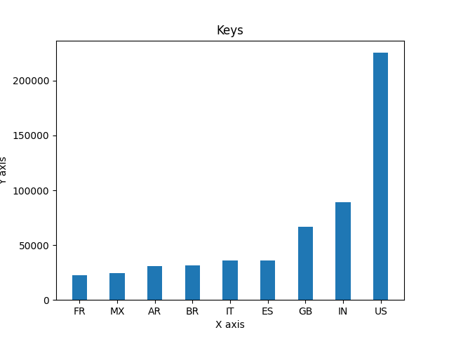
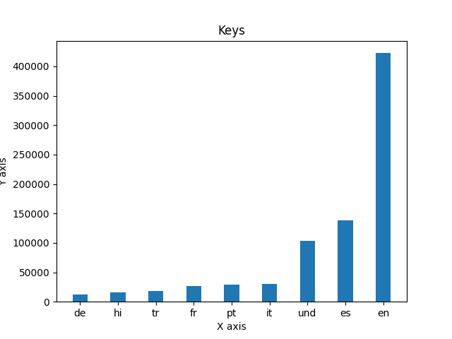
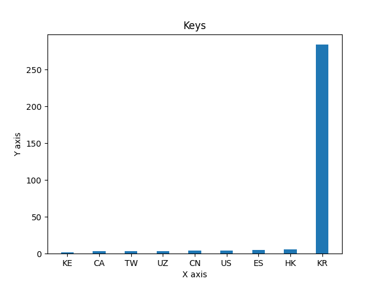
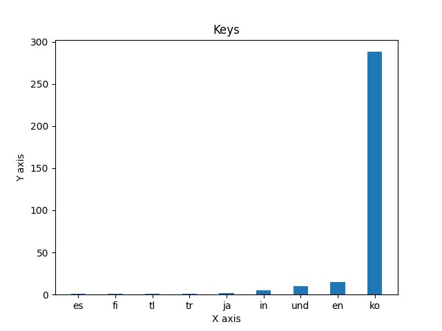

This project analyzes the text of all tweets sent in the year 2020.
First, I sorted through all data to find how many times certain hashtags show up in tweets sorted by the language of the tweet and then sorted by the country of the tweet.
This step was executed by the run\_maps.sh file and the src/map.py file.
Then, the src/reduce.py file counts the number of tweets depending on language and country. 
The file src/visualize.py shows barcharts of the top ten most used countrys/languages of the hashtag depending on the arguments.
I created an alternative\_reduce.py file that counts the number of times hastags are used based on days, and plots them in a line graph with each line corresponding to a different hashtag.

These were all generated by the src/visualize.py file.

This was generated by the src/alternative\_reduce.py function.
